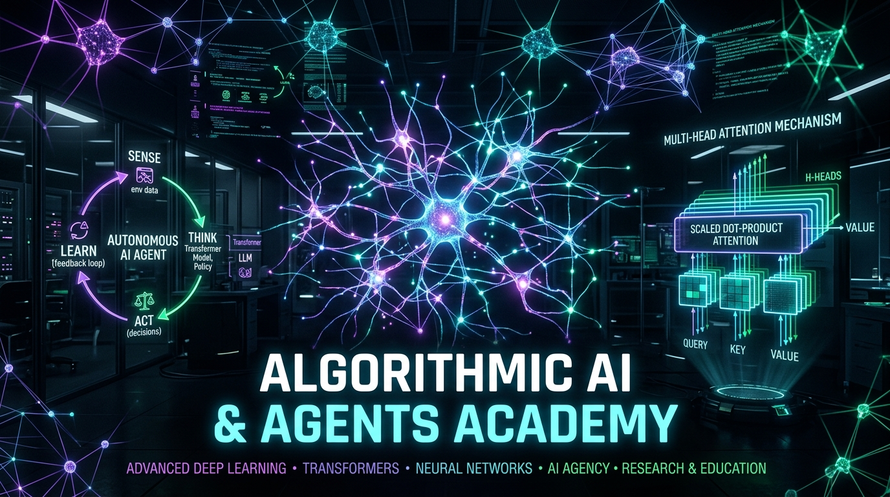

  

# 🧠 DarkAIs AI & Autonomous Agents Academy
**Institutional Deep Learning, Transformers, LoRA Fine-Tuning & Multi-Agent Swarms**

 

### 🌐 [Click Here to Open the Live AI Academy Website](https://karidasd.github.io/ai-academy/)

---

## 📖 Overview
**DarkAIs AI Academy** is an institutional-grade, open-source educational platform designed to take engineers from fundamental neural network calculus to architecting autonomous multi-agent swarms.

---

## ✨ Features & Interactive Hubs
- 🧠 **Neural Sandbox**: Live Canvas backpropagation and loss descent playground.
- 🧮 **LLM Calculator**: Token volume, API cost, and inference latency matrix across top foundation models.
- ⚡ **Prompt-to-Loop Studio**: Visual 7-level agentic workflow builder exporting executable Python LangGraph code.
- 🌌 **Embeddings Explorer**: High-dimensional vector space cosine similarity visualizer.
- 📜 **AI Diploma Generator**: Dynamic certification studio rendering cryptographically hashed Diplomas (PNG).
- 📦 **Downloadable Starter Code**: PyTorch Transformers and LangGraph ReAct agent loops.

---

  <i>Created with passion by <a href="https://karidasd.github.io/">Dimitris Karydas</a> • Part of the DarkAIs Open-Source Ecosystem.</i>

